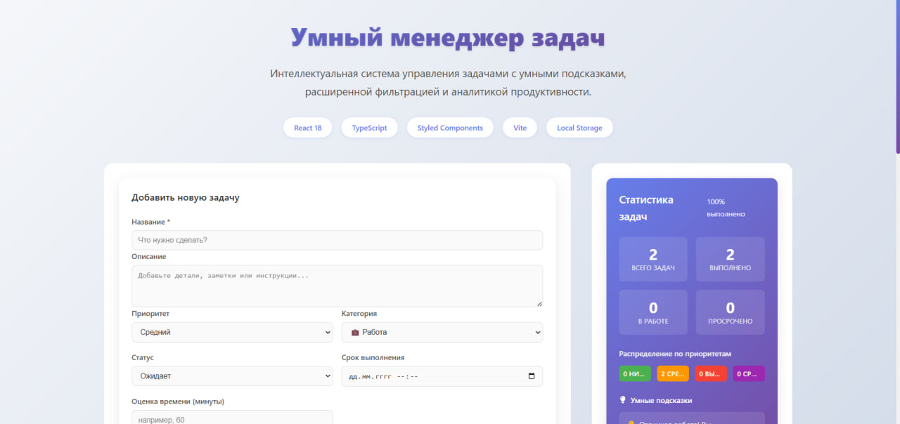
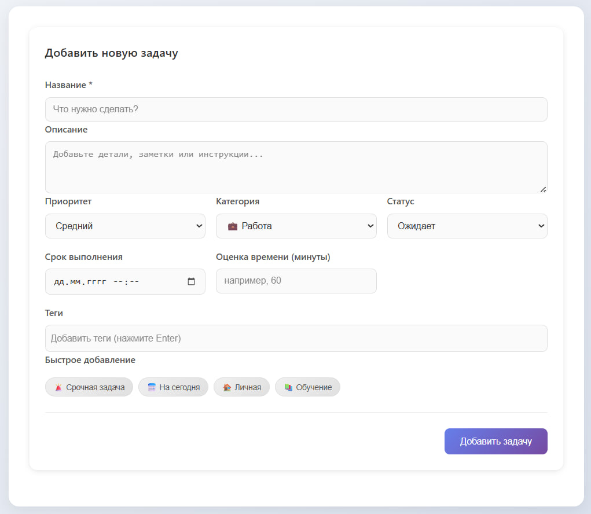
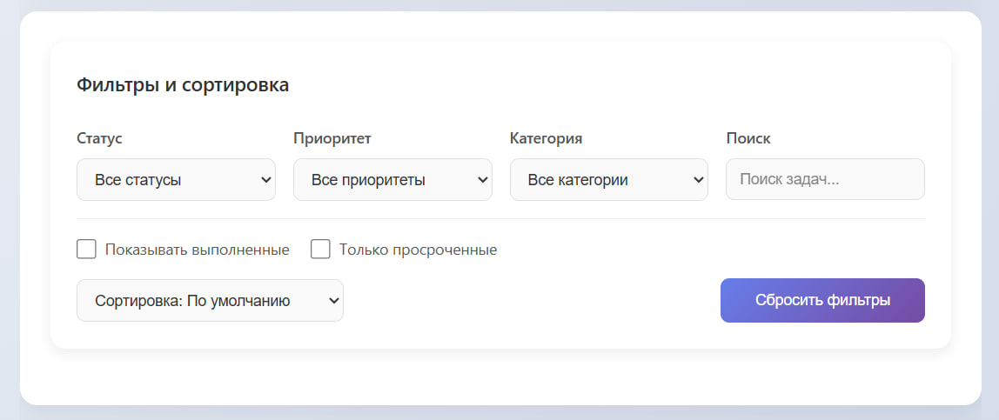
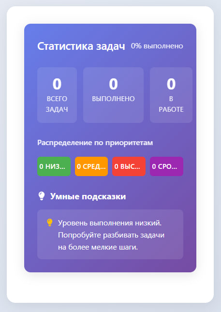

# Умный менеджер задач (Smart Task Manager)

- React
- TypeScript
- Vite
- Styled Components

Продвинутое приложение для управления задачами, разработанное как портфолио проект для демонстрации современных навыков React разработки.
## Демо

**[Посмотреть демо](https://lina-whm.github.io/smart-task-manager/)**

## Скриншоты

| Главный экран | Добавление задачи |
|--------------|------------------|
|  |  |

| Фильтрация | Статистика |
|------------|------------|
|  |  |

## Особенности

### Основные функции
- Умное добавление и управление задачами
- Категоризация по приоритетам (низкий, средний, высокий, срочный)
- Статистика и аналитика продуктивности
- Расширенная фильтрация и поиск
- Локальное хранение данных (Local Storage)
- Полностью адаптивный дизайн

### Умные возможности
- Автоматическое определение просроченных задач
- Анализ уровня выполнения
- Рекомендации по фокусировке

##  Технологический стек

- React 18 - Библиотека для построения пользовательских интерфейсов
- TypeScript - Статическая типизация для надежности кода
- Vite- Современный инструмент сборки
- Styled Components - CSS-in-JS для стилизации
- date-fns - Работа с датами и временем
- UUID - Генерация уникальных идентификаторов

##  Архитектура
-  Компонентный подход 
-  Кастомные хуки для повторного использования логики
-  Типизация с TypeScript для безопасности типов
-  Стилизация через Styled Components
-  Локальное состояние с сохранением в Local Storage

## UX/UI
- Адаптивный дизайн для всех устройств
- Интуитивный интерфейс

## Быстрый старт

### Предварительные требования
- Node.js 18+
- npm или yarn

### Установка

```bash
# Клонирование репозитория
git clone https://github.com/lina-whm/smart-task-manager.git
cd smart-task-manager

# Установка зависимостей
npm install

# Запуск в режиме разработки
npm run dev

# Сборка для production
npm run build

# Превью сборки
npm run preview

## PWA (Progressive Web App)

Это приложение поддерживает установку как PWA! Вы можете установить его на свой телефон:

### Установка на телефон:

**Android (Chrome):**
1. Откройте приложение в браузере Chrome
2. Нажмите "Установить" в адресной строке или в меню браузера
3. Или дождитесь предложения установить приложение

**iOS (Safari):**
1. Откройте приложение в Safari
2. Нажмите кнопку "Поделиться"
3. Выберите "На экран «Домой»"
4. Нажмите "Добавить"


### Доступ к приложению:
- **Веб-версия:** [https://lina-whm.github.io/smart-task-manager](https://lina-whm.github.io/smart-task-manager)
- **PWA:** Установите с сайта на телефон