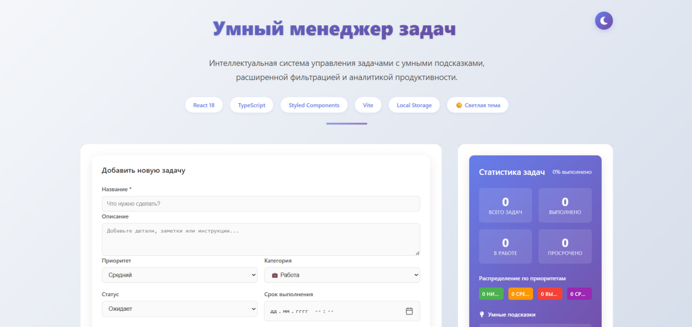
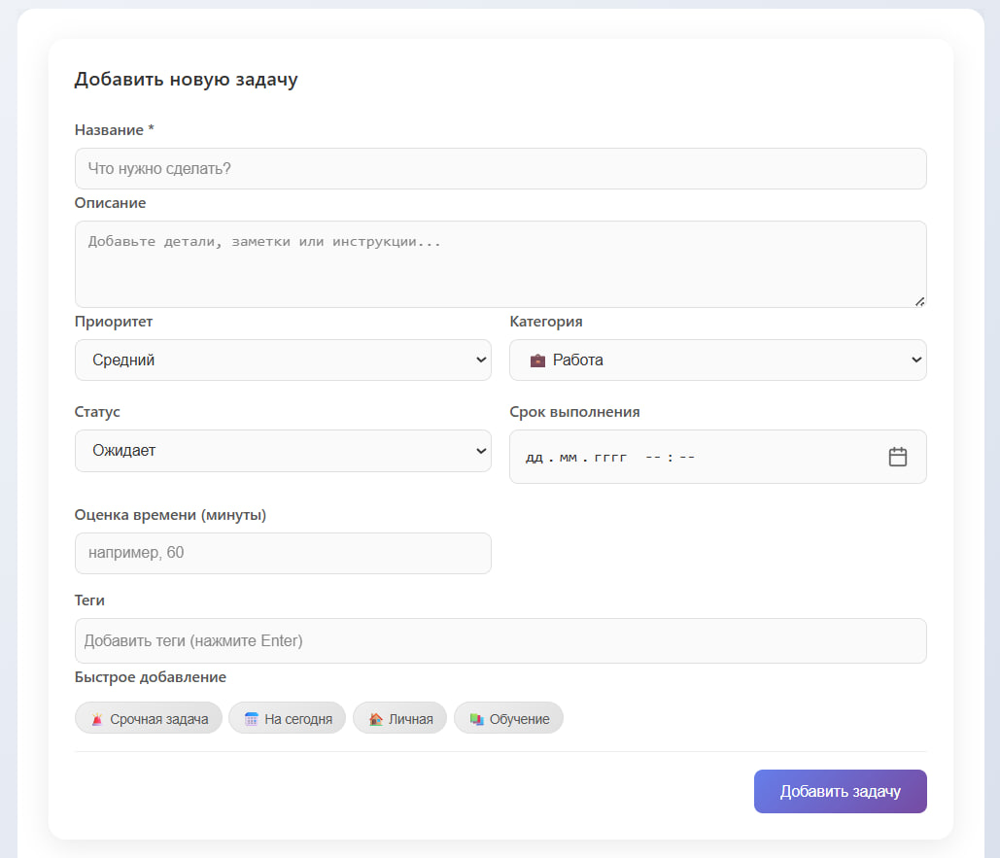
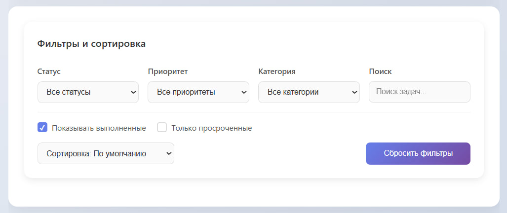
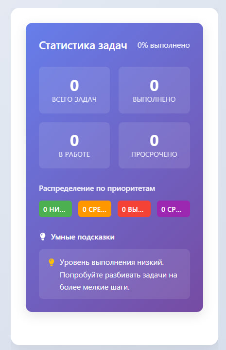
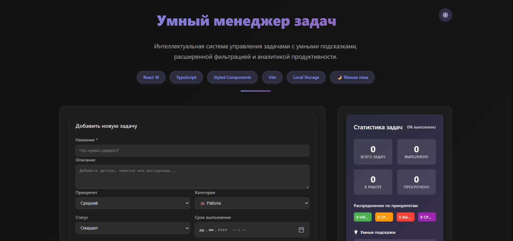
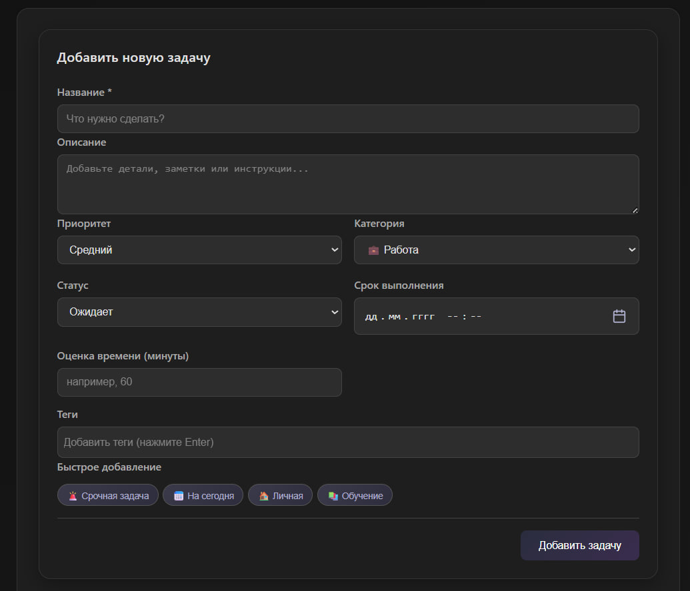
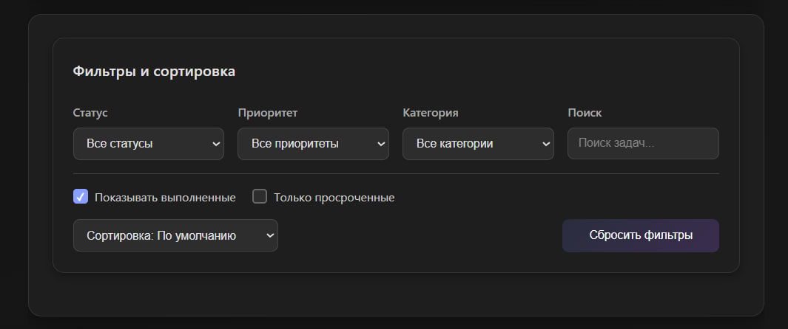
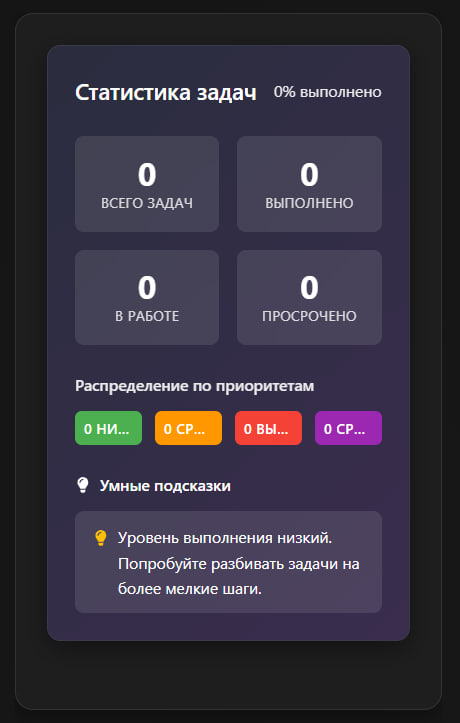

# Умный менеджер задач (Smart Task Manager)

- React
- TypeScript
- Vite
- Styled Components

Продвинутое приложение для управления задачами, разработанное как портфолио проект для демонстрации современных навыков React разработки.
## Демо

**[Посмотреть демо](https://lina-whm.github.io/smart-task-manager/)**

> ** Установите как PWA:** Доступно для установки на Android и iOS! Работает оффлайн.

## Скриншоты

### Светлая тема
| Главный экран | Добавление задачи | Фильтрация | Статистика |
|--------------|------------------|------------|------------|
|  |  |  |  |

### Темная тема 
| Главный экран | Добавление задачи | Фильтрация | Статистика |
|--------------|------------------|------------|------------|
|  |  |  |  |

## Особенности

### Основные функции
-  Умное добавление и управление задачами
-  **Светлая/темная тема** 
-  Категоризация по приоритетам (низкий, средний, высокий, срочный)
-  Статистика и аналитика продуктивности
-  Расширенная фильтрация
-  Локальное хранение данных (Local Storage)
-  Полностью адаптивный дизайн (мобильные, планшеты, десктоп)

###  Умные возможности
- Автоматическое определение просроченных задач
- Интеллектуальные подсказки и рекомендации
- Система тегов и категорий

###  Премиум функции
-  **Уведомления о обновлениях** PWA
-  **Быстрые действия** для продуктивности
-  **Примеры задач** одним кликом

##  Технологический стек

### Frontend
- **React 18** 
- **TypeScript 5** 
- **Vite 5**
- **Styled Components 6**

### Утилиты
- **date-fns** 
- **UUID** 
- **React Icons** 

### PWA
- **Vite PWA Plugin** 
- **Service Workers** 

##  Архитектура

### Структура проекта
src/
├── components/ # React компоненты 
│ ├── AddTaskForm/ # Форма добавления/редактирования
│ ├── TaskItem/ # Элемент задачи
│ ├── TaskList/ # Список задач
│ ├── TaskFilters/ # Фильтры и сортировка
│ ├── TaskStats/ # Статистика и аналитика
│ └── EmptyState/ # Пустые состояния
├── contexts/ # React контексты (Тема, Состояние)
├── hooks/ # Кастомные хуки
│ ├── useLocalStorage # Работа с Local Storage
│ └── usePWAUpdate # Обновления PWA
├── types/ # TypeScript типы
├── utils/ # Вспомогательные функции
└── constants/ # Константы приложения

### Ключевые принципы
-  **Компонентный подход** 
-  **Кастомные хуки** 
- **Типизация TypeScript** 
-  **CSS-in-JS** 
- **Локальное состояние** 
- **PWA First** 

### Адаптивный дизайн
- Адаптация под все размеры экранов
- Поддержка планшетов и десктопов

### Темная тема 
- **Сохранение выбора** в Local Storage
- **Гармоничные цвета** без резких контрастов

### Интерактивность
-  Быстрые действия одним кликом
-  Визуальная статистика в реальном времени
-  Контекстные подсказки и рекомендации

##  Быстрый старт

### Предварительные требования
- Node.js 18+
- npm или yarn

### Установка и запуск

```bash
# Клонирование репозитория
git clone https://github.com/lina-whm/smart-task-manager.git
cd smart-task-manager

# Установка зависимостей
npm install

# Запуск в режиме разработки
npm run dev

# Сборка для production
npm run build

# Превью сборки
npm run preview

# Деплой на GitHub Pages
npm run deploy

Доступ к приложению:
Веб-версия: https://lina-whm.github.io/smart-task-manager

PWA: Установите с сайта на телефон
Установка на телефон
Android (Chrome):
Откройте приложение в браузере Chrome
Нажмите "Установить" в адресной строке или в меню браузера
Или дождитесь предложения установить приложение

iOS (Safari):
Откройте приложение в Safari
Нажмите кнопку "Поделиться" 
Прокрутите вниз и выберите "На экран «Домой»"
Нажмите "Добавить"

Автор
Полина - GitHub